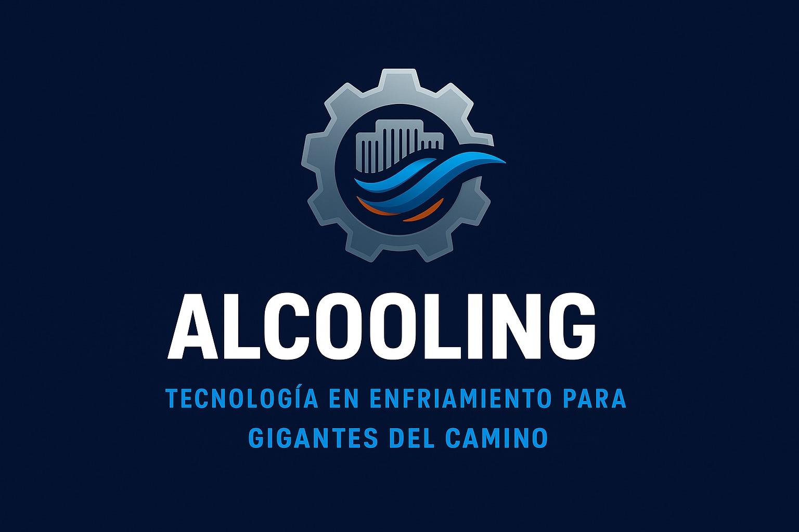

# 🌐 Advanced Line Cooling — Sitio Web Oficial




Sitio web corporativo desarrollado para **Advanced Line Cooling S.A.C.**, una empresa dedicada a la **venta y distribución de radiadores y sistemas de refrigeración para camiones de carga pesada y maquinaria industrial**.  
El objetivo del proyecto es ofrecer una **plataforma informativa moderna, rápida y optimizada**, donde los clientes puedan conocer la empresa, sus productos y sus vías de contacto de forma clara y profesional.

---

## 🚀 Tecnologías utilizadas

- ⚛️ **React** — Librería principal para la interfaz de usuario
- ⚡ **Vite (React + SWC)** — Entorno de desarrollo ultrarrápido con compilación SWC
- 🧩 **JavaScript (ESNext)** — Lenguaje base del proyecto
- 🎨 **HTML5 semántico** — Maquetación accesible y estructurada
- 🎯 **CSS Modules** — Estilos encapsulados por componente/página
- 🟣 **Bootstrap 5** — Sistema de diseño y utilidades responsive
- ✨ **AOS** — Animaciones al hacer scroll para una experiencia visual atractiva
- 📝 **react-hook-form** — Manejo y validación eficiente de formularios en React
- 🌐 **Git & GitHub** — Control de versiones y despliegue
- 🌎 **React-i18next** — Internacionalización y soporte multilenguaje

---

## 📦 Instalación y uso

Sigue los pasos para ejecutar el proyecto en tu entorno local:

```bash
# 1. Clona este repositorio
git clone https://github.com/jAlejandroGM/advancedline-cooling-web.git

# 2. Accede al directorio
cd advancedline-cooling-web

# 3. Instala las dependencias
npm install

# 4. Inicia el servidor de desarrollo
npm run dev
```

Luego, abre tu navegador en: `http://localhost:5173`

---

## 📁 Estructura del proyecto

```bash
advancedline-cooling-web/
├── public/               # Archivos estáticos (favicons, imágenes, etc.)
├── src/
│   ├── assets/           # Recursos multimedia e íconos
│   ├── components/       # Componentes reutilizables (Navbar, Footer, etc.)
│   ├── locales/          # Archivos de traducción por idioma
│   ├── pages/            # Páginas principales (Home, About, Products, Contact)
│   ├── routes/           # Definición de rutas con React Router
│   ├── styles/           # Estilos globales o módulos CSS
│   ├── App.jsx           # Componente principal de la aplicación
│   ├── i18n.js           # Configuración de internacionalización
│   └── main.jsx          # Punto de entrada del proyecto
├── index.html            # Documento base HTML
├── package.json          # Configuración del proyecto y scripts
└── README.md             # Documentación del proyecto
```

---

## 🌎 Internacionalización

El sitio soporta cambio dinámico de idioma (**Español** 🇪🇸 / **Inglés** 🇬🇧) gracias a la integración de [React-i18next](https://react.i18next.com/).

- 🌐 Todos los textos de la interfaz están centralizados en archivos de traducción dentro de `locales/`.
- 💾 El idioma seleccionado se guarda automáticamente en el navegador.
- 📝 Para agregar o modificar traducciones, edita los archivos `translation.json` en las carpetas de cada idioma.

---

## 📸 Vista previa


---

## 📄 Licencia

Este proyecto es de uso privado y fue desarrollado exclusivamente para Advanced Line Cooling S.A.C.  
No se permite su redistribución, modificación o uso comercial sin autorización previa del autor.

---

## 👨‍💻 Autor

Diseñado y desarrollado con ☕ por
**José Alejandro Guzmán Mendoza**  
[🌍 **GitHub**](https://github.com/jAlejandroGM)

> 💬 “Un sitio web sólido es el reflejo de una empresa confiable.”
